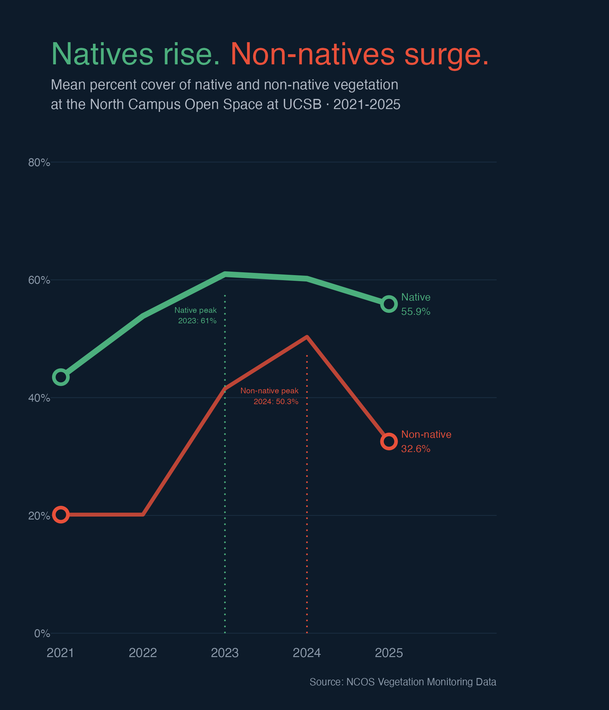

# Intermediate Elective Option 2

## General information

This repository contains the code and data for the ENVS 193DS 
intermediate elective option 2. The elective uses vernal pool 
vegetation monitoring data from the North Campus Open Space (NCOS) 
at UCSB to create a figure inspired by Steven Ponce's 
"Coal falls. Renewables rise." visualization.

## Data and file information

- `data/raw/veg.csv`: raw vegetation survey data from NCOS (2021-2025)
- `data/raw/vp_veg_metadata.csv`: transect metadata including number of quadrats per transect per year
- `code/intermediate-elective.qmd`: main analysis and visualization code
- `code/intermediate-elective.pdf`: rendered PDF output
- `outputs/native_nonnative_cover.png`: final saved figure
- `outputs/sketch.jpg`: hand-drawn sketch of planned figure (Problem 2)

## Rendered output

[Link to rendered PDF](https://github.com/lperusa7/intermediate-elective/blob/main/code/initial_eda.pdf)

