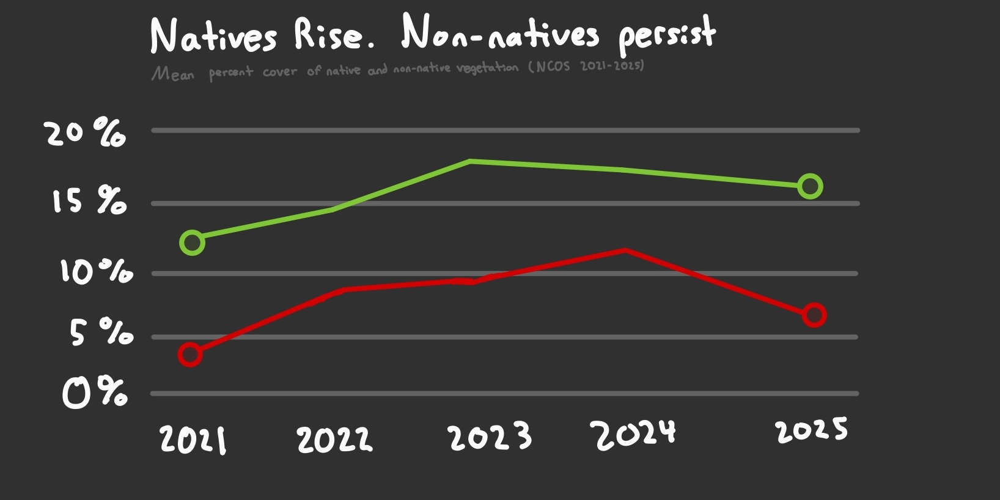

# Problem 1: Explain Your Inspiration

## Which visualization:

For this elective, I chose Steven Ponce's "Coal falls. Renewables rise." plot for my inspiration, which is a line plot tracking the share of coal and renewable electricity generation in China from 2000 to 2023.

## Why it makes sense:

This visualization makes sense for the NCOS vegetation dataset because both share the same underlying structure which is having two main competing categories measured as a percentage over time. Just as coal and renewables represent opposing forces in energy generation, native and non-native plant cover represent opposing forces of the ecological health at NCOS.

## Which variables:

The visualization will use `year` (2021 - 2025), `cover_category` (native vs. non-native), and `mean_pc` (which I will calculate using the `percent_cover` column). Year will be mapped on the x-axis, Mean Percent Cover will be mapped on the y-axis, and cover category will be the color, which I plan to use green for native cover and red for non-native cover. Overall, this will mirror the two line structure from the inspiration figure.

# Problem 2: Plan Your Figure



# Problem 3: Code Your Figure

## Set Up

### Packages

```{r}
#| label: packages
#| message: false
#| warning: false

# data wrangling
library(tidyverse)

# file organization
library(here)

# exploring missing data
library(naniar)

# styled text in ggplot (colored title, markdown)
library(ggtext)

# custom font loading
library(showtext)

# string interpolation for annotations and labels
library(glue)

# clean axis label formatting (percent signs etc.)
library(scales)
```

### Data

```{r}
#| label: reading in data
#| message: false

veg <- read_csv(here("data", "raw", "veg.csv"))

metadata <- read_csv(here("data", "raw", "vp_veg_metadata.csv"))
```

## a. Exploring the Data

```{r}
#| label: exploring structure
#| message: false
#| warning: false
#| results: hide

# examine structure of both datasets
glimpse(veg)
glimpse(metadata)
```

```{r}
#| label: exploring unique and NAs
#| message: false
#| warning: false
#| results: hide

# check unique values in character columns for both datasets
veg |> select(where(is.character)) |> map(unique)
metadata |> select(where(is.character)) |> map(unique)

# visualize missing data patterns in both datasets
gg_miss_var(veg)
gg_miss_var(metadata)
```

## b. Wrangling Data

```{r}
#| label: wrangling data
#| message: false
#| warning: false

# creating new object from veg
cover_explicit0 <- veg |>
  # filter to native and non-native cover only
  filter(cover_category %in% c("NATIVE COVER", "NON-NATIVE COVER")) |>
  # group by year, transect, and cover category
  group_by(year, transect_name, cover_category) |>
  # sum percent cover across all quadrats per transect per year
  summarise(sum_pc = sum(percent_cover, na.rm = TRUE), .groups = "drop") |>
  # combine year and transect for joining with metadata
  unite("year_pool", year, transect_name, remove = FALSE) |>
  # join only num_quad from metadata
  left_join(metadata |> select(year_pool, num_quad), by = "year_pool") |>
  # calculate mean percent cover as total / number of quadrats
  mutate(mean_pc = sum_pc / num_quad)

# summarise mean percent cover by year across all transects
cover_summary <- cover_explicit0 |>
  # groupy by year and cover category
  group_by(year, cover_category) |>
  # calculate mean pc; drop the groups
  summarise(mean_pc = mean(mean_pc, na.rm = TRUE), .groups = "drop")

# check result
cover_summary
```

## c. Visualization

### Paramaters

```{r}
#| label: visualization parameters
#| message: false
#| warning: false

# define colors - taken directly from inspiration plot
bg_color      <- "#0D1B2A"   # dark navy background
col_native    <- "#4CAF7D"   # green for native cover
col_nonnative <- "#E8503A"   # red for non-native cover
text_white    <- "#FFFFFF"   # white for title text
text_muted    <- "#8A98A8"   # muted blue-grey for axis text
text_sub      <- "#B0B8C4"   # lighter muted for subtitle
grid_color    <- "#1A2E42"   # dark blue for manual grid lines
accent_coral  <- "#E8503A"   # accent color for annotation lines

# extract 2025 endpoint value from native for direct line labels
val_native_2025 <- cover_summary |>
  # filter to only include 2025 and Native Cover 
  filter(year == 2025, cover_category == "NATIVE COVER") |>
  # extract mean_pc as a vector
  pull(mean_pc) |>
  # round to 1 decimal place
  round(1)

# extract 2025 endpoint value from non-native for direct line labels
val_nonnative_2025 <- cover_summary |>
  # filter to only include 2025 and Native Cover 
  filter(year == 2025, cover_category == "NON-NATIVE COVER") |>
  # extract mean_pc as a vector
  pull(mean_pc) |>
  # round to 1 decimal place
  round(1)

# extract peak value from native for annotation lines
val_native_2023 <- cover_summary |>
  # filter to only include 2025 and Native Cover
  filter(year == 2023, cover_category == "NATIVE COVER") |>
  # extract mean_pc as a vector
  pull(mean_pc) |>
  # round to 1 decimal place
  round(1)

# extract peak value from non-native for annotation lines
val_nonnative_2024 <- cover_summary |>
  # filter to only include 2025 and Native Cover
  filter(year == 2024, cover_category == "NON-NATIVE COVER") |>
  # extract mean_pc as a vector
  pull(mean_pc) |>
  # round to 1 decimal place
  round(1)

# build title text with inline color styling - taken from inspiration
title_text <- glue(
  "<span style='font-weight:900; color:{col_native};'>Natives rise. </span>",
  "<span style='font-weight:900; color:{col_nonnative};'>Non-natives surge.</span>"
)

# build subtitle text - taken from inspiration
subtitle_text <- glue(
  "<span style='font-size:10pt; font-weight:400; color:{text_sub};'>",
  "Mean percent cover of native and non-native vegetation at the North Campus<br>",
  "Open Space at UCSB · 2021-2025",
  "</span>"
)

# caption text
caption_text <- "Source: NCOS Vegetation Monitoring Data"
```

### Plot

```{r}
#| label: plot
#| warning: false
#| fig-width: 6
#| fig-height: 7

# build main plot - structure taken directly from inspiration
p <- cover_summary |>
  ggplot(aes(x = year, y = mean_pc, color = cover_category, group = cover_category)) +
  
  # Geom
  # manual horizontal grid lines - taken from inspiration
  geom_hline(
    yintercept = seq(0, 80, by = 20),
    color = grid_color,
    linewidth = 0.25
  ) +
  # native cover line - heavier weight, taken from inspiration
  geom_line(
    data = cover_summary |> filter(cover_category == "NATIVE COVER"),
    linewidth = 1.9,
    alpha = 1.0
  ) +
  # non-native cover line - lighter weight, taken from inspiration
  geom_line(
    data = cover_summary |> filter(cover_category == "NON-NATIVE COVER"),
    linewidth = 1.3,
    alpha = 0.80
  ) +
  # open circle at start year 2021 - taken from inspiration
  geom_point(
    data = cover_summary |> filter(year == 2021),
    size = 3.5, shape = 21, fill = bg_color, stroke = 1.8
  ) +
  # open circle at end year 2025 - taken from inspiration
  geom_point(
    data = cover_summary |> filter(year == 2025),
    size = 3.5, shape = 21, fill = bg_color, stroke = 1.8
  ) +
  
  # Annotate
  # dotted vertical line at native cover peak (2023) - taken from inspiration
  annotate(
    "segment",
    x = 2023, xend = 2023,
    y = 0, yend = val_native_2023 - 3,
    color = col_native,
    linewidth = 0.5,
    linetype = "dotted"
  ) +
  # text annotation for native cover peak - taken from inspiration
  annotate(
    "text",
    x = 2022.9,
    y = val_native_2023 - 7,
    label = glue("Native peak\n2023: {val_native_2023}%"),
    hjust = 1,
    size = 2,
    color = col_native,
    lineheight = 1.1
  ) +
  # dotted vertical line at non-native cover peak (2024) - taken from inspiration
  annotate(
    "segment",
    x = 2024, xend = 2024,
    y = 0, yend = val_nonnative_2024 - 3,
    color = col_nonnative,
    linewidth = 0.5,
    linetype = "dotted"
  ) +
  # text annotation for non-native cover peak - taken from inspiration
  annotate(
    "text",
    x = 2023.9,
    y = val_nonnative_2024 - 10,
    label = glue("Non-native peak\n2024: {val_nonnative_2024}%"),
    hjust = 1,
    size = 2,
    color = col_nonnative,
    lineheight = 1.1
  ) +
  # direct line labels at 2025 endpoint - taken from inspiration
  annotate(
    "text",
    x = 2025.15,
    y = c(val_native_2025, val_nonnative_2025),
    label = c(
      glue("Native\n{val_native_2025}%"),
      glue("Non-native\n{val_nonnative_2025}%")
    ),
    hjust = 0, vjust = 0.5, size = 2.6,
    color = c(col_native, col_nonnative),
    lineheight = 1.15
  ) +
  
  # Scales
  # map colors to cover categories - taken from inspiration
  scale_color_manual(
    values = c("NATIVE COVER" = col_native, "NON-NATIVE COVER" = col_nonnative)
  ) +
  # x-axis: expand right to make room for direct labels - taken from inspiration
  scale_x_continuous(
    breaks = 2021:2025,
    expand = expansion(mult = c(0.03, 0.28))
  ) +
  # y-axis: percent labels - taken from inspiration
  scale_y_continuous(
    limits = c(0, 80),
    breaks = seq(0, 80, by = 20),
    labels = \(x) glue("{x}%"),
    expand = expansion(mult = c(0.01, 0.04))
  ) +
  
  # Labs
  # two-color styled title and subtitle using glue objects - taken from inspiration
  labs(
    title    = title_text,
    subtitle = subtitle_text,
    caption  = caption_text,
    x = NULL,
    y = NULL
  ) +
  
  # Theme
  theme_void() +
  theme(
    # dark navy background - taken from inspiration
    plot.background  = element_rect(fill = bg_color, color = NA),
    panel.background = element_rect(fill = bg_color, color = NA),
    # styled two-color title using ggtext - taken from inspiration
    plot.title = element_markdown(
      size = 22, color = text_white, hjust = 0,
      lineheight = 1.1, margin = margin(t = 10, b = 6)
    ),
    # subtitle as markdown to allow color styling - taken from inspiration
    plot.subtitle = element_markdown(
      size = 10, color = text_sub, hjust = 0,
      lineheight = 1.4, margin = margin(b = 22)
    ),
    # caption styling - taken from inspiration
    plot.caption = element_text(
      size = 7, color = text_muted, hjust = 1,
      margin = margin(t = 14)
    ),
    # axis text styling - taken from inspiration
    axis.text.x = element_text(
      size = 9, color = text_muted, margin = margin(t = 6)
    ),
    axis.text.y = element_text(
      size = 8, color = text_muted, hjust = 1
    ),
    # remove axis lines, ticks, and grid - taken from inspiration
    axis.line   = element_blank(),
    axis.ticks  = element_blank(),
    panel.grid  = element_blank(),
    # remove legend since we use direct labels - taken from inspiration
    legend.position = "none",
    # expanded right margin for direct labels - taken from inspiration
    plot.margin = margin(t = 20, r = 80, b = 16, l = 20)
  )

p
```

## d. Saving Figure

```{r}
#| label: save
#| warning: false
#| message: false

# save final figure as png to outputs folder
ggsave(
  filename = here("outputs", "native_nonnative_cover.png"),
  plot = p,
  width = 6,
  height = 7,
  dpi = 320
)
```

# Problem 4: Describe Your Process

**Process:**
Rather than forking the repository, I copied the relevant code directly from Steven Ponce's publicly available visualization and used it as a reference while building my own figure in a separate .qmd file. I replaced his data, variables, and custom utility functions with my own, keeping the core structure, geometry, and theme elements as close to the original as possible.

**Challenges:**
The main challenges involved adapting code that relied on custom utility functions (get_theme_colors(), setup_fonts(), create_dcc_caption()) that were not accessible from his repository, which required replacing them with base R and ggplot2 equivalents. Additionally, wrangling the vegetation data to calculate accurate mean percent cover required careful decisions about how to handle implicit zeros, specifically, whether to divide by the number of quadrats sampled or only those with recorded observations. Positioning the annotation text without overlapping the lines was also difficult given the compressed 5-year x-axis range.

**Differences from class:**
This visualization is more sophisticated than any of the figures we have produced in class or for any previous assignments, primarily because it prioritizes storytelling and aesthetics alongside data accuracy. Previous figures focused on clearly communicating patterns with minimal customization, while this figure uses a dark background, colored markdown titles, direct line labels, and annotated callouts to guide the reader toward a specific narrative conclusion about native and non-native vegetation trends at NCOS.
